# 🐾 流浪动物救助系统

基于 Spring Boot 3 + Vue 3 的前后端分离项目。普通用户可以浏览动物档案、提交领养申请、上报流浪动物求助、在论坛交流经验、学习养护知识；管理员负责动物档案、领养审核、救助处理和内容运营，并通过数据看板掌握平台情况。

系统会根据用户的浏览、点赞、收藏行为构建偏好画像，用 Jaccard 相似度做协同过滤，实现个性化的动物推荐。

## 界面预览

| 用户首页 | 动物列表 |
| :---: | :---: |
| 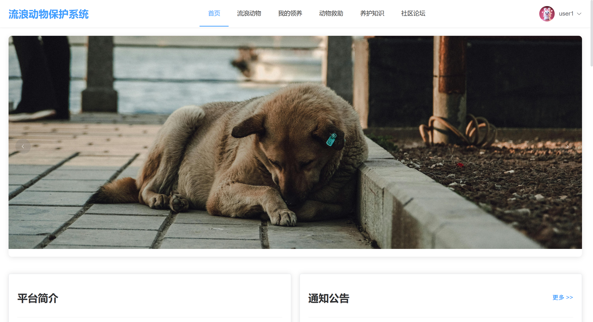 | 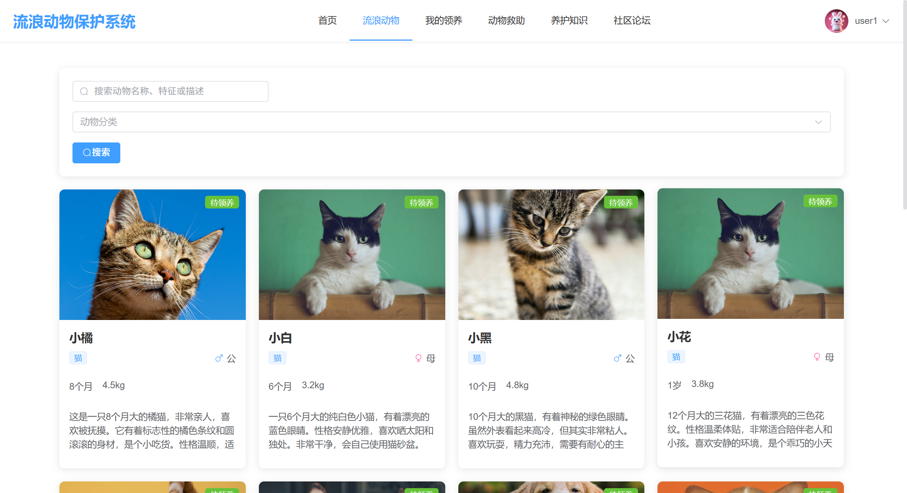 |

| 救助上报 | 社区论坛 |
| :---: | :---: |
| 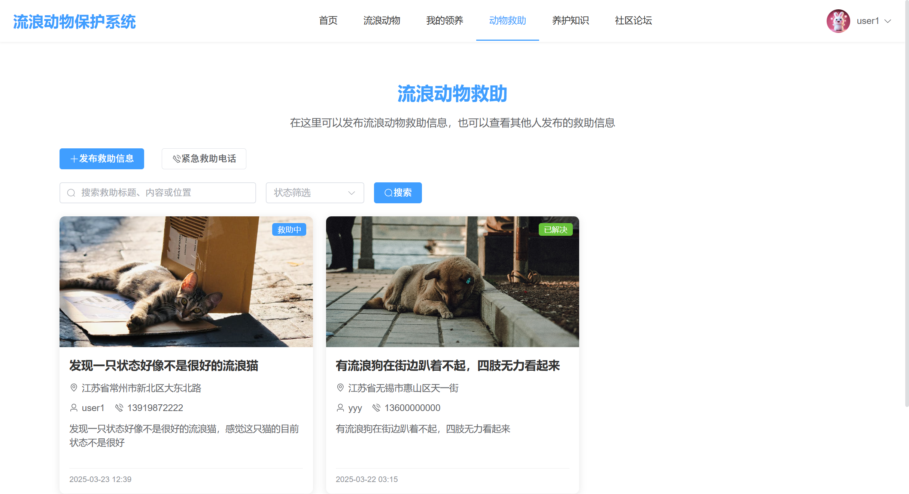 | 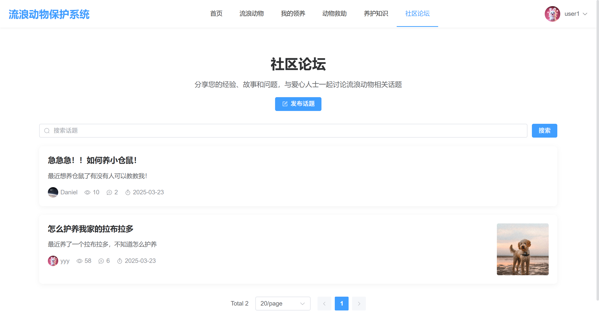 |

| 管理端数据看板 | 动物管理 |
| :---: | :---: |
| 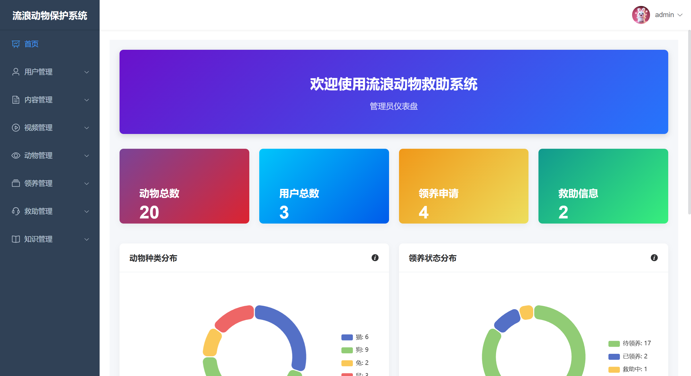 | 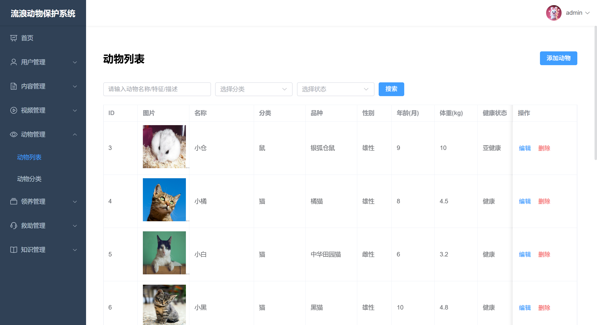 |

<details>
<summary>更多截图（登录 / 首页 / 知识科普 / 领养审核 / 用户管理 / 管理后台）</summary>

| | |
| :---: | :---: |
| 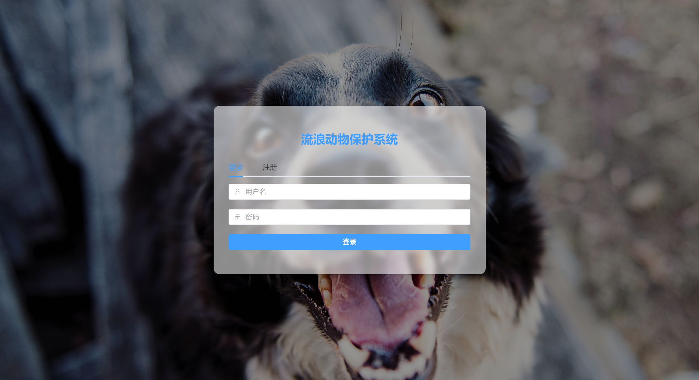 |  |
| 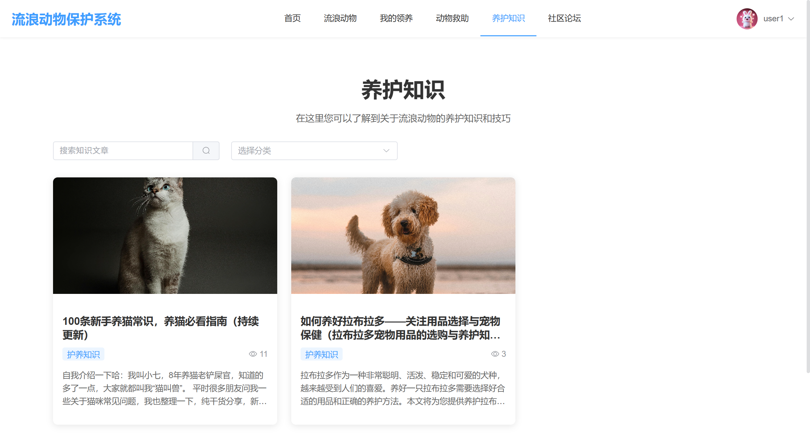 | 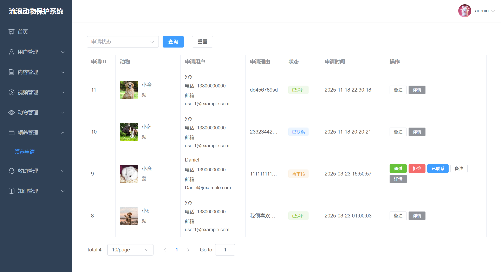 |
| 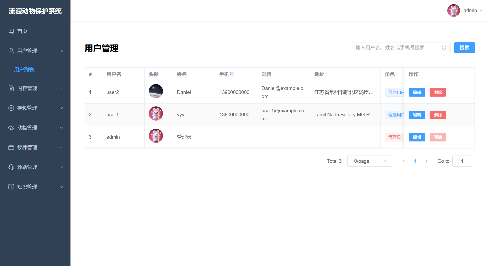 |  |

</details>

## 主要功能

用户端：

- 注册登录：JWT 认证，登录后按角色自动进入用户端或管理端
- 首页：轮播图与通知公告
- 动物档案：列表与详情浏览，支持点赞、收藏、评论
- 领养申请：在线提交，实时跟踪审核状态
- 救助上报：发布流浪动物求助信息（位置、照片、联系方式），跟踪处理进度
- 社区论坛：发帖、回帖、评论
- 知识科普：养护知识文章与视频
- 个性化推荐：基于行为的协同过滤推荐，可设置偏好、查看收藏
- 个人中心：资料维护、修改密码

管理端：

- 数据看板：动物、用户、领养、救助核心指标与分布图表（ECharts）
- 动物管理：动物档案与分类维护
- 领养审核：通过或拒绝申请，自动联动动物状态
- 救助处理：救助信息受理与状态流转
- 内容管理：知识分类与文章、视频与视频分类
- 运营管理：轮播图、通知公告
- 用户管理：启用禁用、重置密码

## 技术栈

| 层 | 技术 |
| --- | --- |
| 后端 | Java 21 · Spring Boot 3.0.5 · MyBatis-Plus 3.5.3 · MySQL 8.0 · Druid · JWT（jjwt 0.11.5）· Knife4j 4.1 · Hutool · Lombok |
| 前端 | Vue 3.3 · Vue CLI 5 · Vue Router 4 · Pinia · Element Plus 2.4 · ECharts 5.6 · Axios · Sass |

## 系统架构

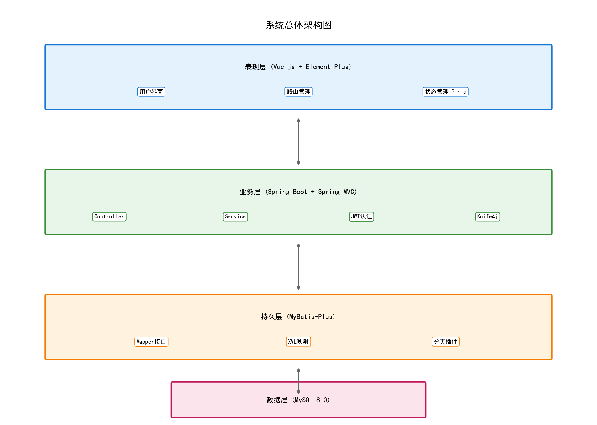

<details>
<summary>更多设计图（ER 图 / 功能模块图 / 用例图 / 各业务流程图，见 docs/diagrams/）</summary>

| ER 图 | 功能模块图 |
| :---: | :---: |
| 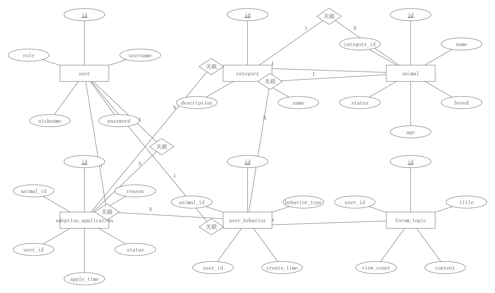 | 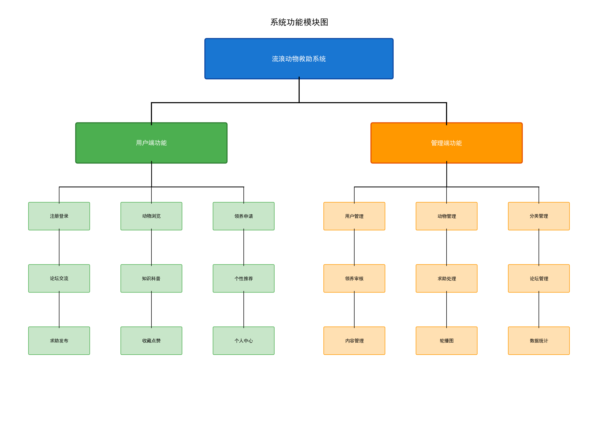 |

| 用例图 | 领养流程 |
| :---: | :---: |
| 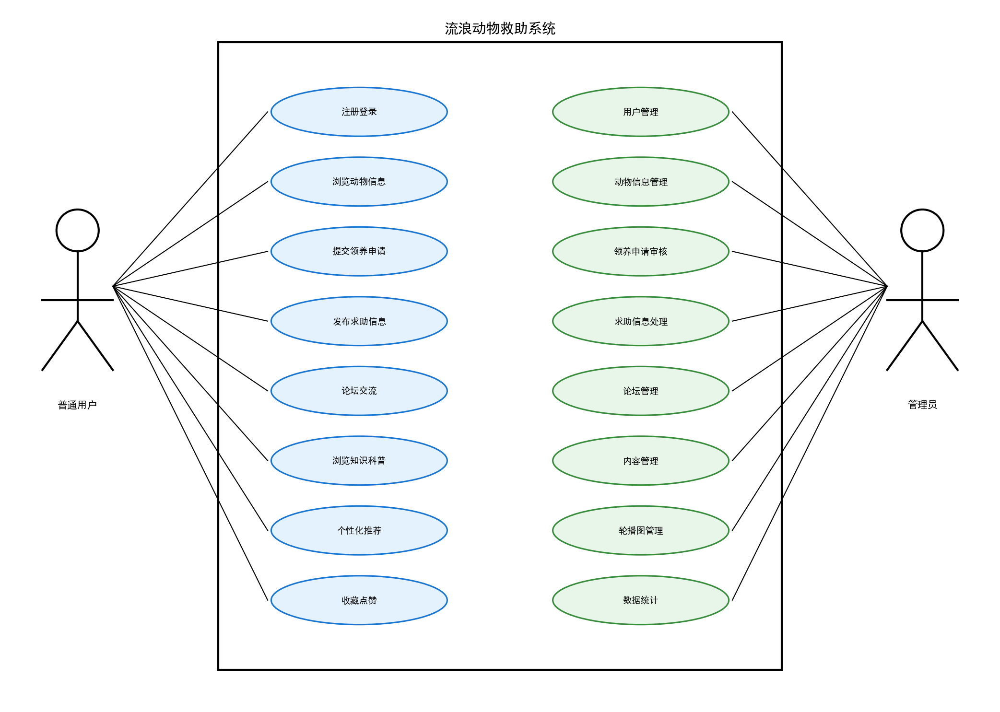 | 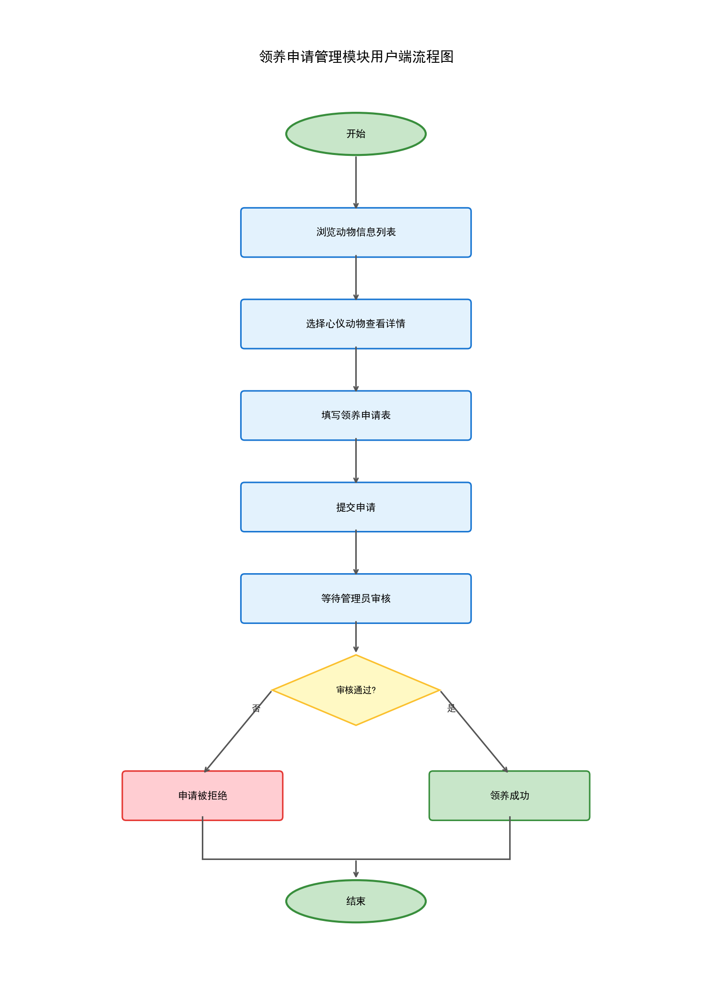 |

</details>

### 推荐算法

推荐模块的处理流程：采集用户行为（浏览、点赞、收藏）并按权重打分，构建用户偏好向量；计算用户间的 Jaccard 相似度，取 Top-10 相似用户；聚合相似用户偏好的动物并加权排序，输出推荐结果。

流程图见 [docs/diagrams/recommendation_flowchart.png](docs/diagrams/recommendation_flowchart.png)，实现代码在 `backend/src/main/java/com/stray/animal/rescue/recommendation/`。

## 快速开始

依赖环境：JDK 21、Maven 3.8+、MySQL 8.0、Node.js 16+。

1. 初始化数据库：

```bash
mysql -u root -p < backend/src/main/resources/sql/init.sql
```

脚本自带建库语句（`stray_animal_rescue`）和演示数据。

2. 启动后端（端口 8080，context-path `/api`）：

```bash
cd backend
mvn spring-boot:run
```

数据库账号密码在 `backend/src/main/resources/application.yml` 中修改，或用环境变量 `MYSQL_USERNAME` / `MYSQL_PASSWORD` 注入。接口文档地址 `http://localhost:8080/api/doc.html`。

3. 启动前端（端口 3000）：

```bash
cd frontend
npm install
npm run serve
```

打开 `http://localhost:3000`，开发代理会把 `/api`、`/uploads` 转发到后端。

默认账号：

| 角色 | 用户名 | 密码 |
| --- | --- | --- |
| 管理员 | admin | 123456 |
| 普通用户 | user1 | 123456 |
| 普通用户 | user2 | 123456 |

两点说明：演示数据里引用的图片和视频文件没有放进仓库（体积原因），相关列表会显示图片占位，上传新内容后正常；本项目定位教学演示，演示数据中的用户密码为明文存储，也未接入验证码和限流，用于生产环境前需要自行加固。

## 项目结构

```
stray-animal-rescue-system
├── backend/                                    # Spring Boot 3 后端
│   ├── src/main/java/com/stray/animal/rescue/
│   │   ├── controller/                         # REST 接口（用户/动物/领养/救助/论坛/知识/推荐/管理端）
│   │   ├── service/                            # 业务逻辑
│   │   ├── recommendation/                     # 协同过滤推荐
│   │   ├── mapper/                             # MyBatis-Plus 数据访问
│   │   ├── entity/ dto/ vo/                    # 数据模型
│   │   ├── config/ interceptor/                # 配置与 JWT 拦截器
│   │   └── util/ common/ exception/            # 工具与统一异常处理
│   └── src/main/resources/
│       ├── application.yml                     # 核心配置（数据库 / 上传路径 / Knife4j）
│       └── sql/init.sql                        # 数据库初始化脚本（含建库与演示数据）
├── frontend/                                   # Vue 3 前端
│   └── src/
│       ├── views/                              # 页面（user/ 用户端 + admin/ 管理端）
│       ├── components/                         # 公共组件
│       ├── api/                                # Axios 接口层
│       ├── store/                              # Pinia 状态管理
│       └── router/                             # 路由与权限守卫
├── docs/diagrams/                              # 架构图 / ER 图 / 流程图
├── screenshots/                                # 界面截图
└── LICENSE
```

## License

[MIT](LICENSE)
